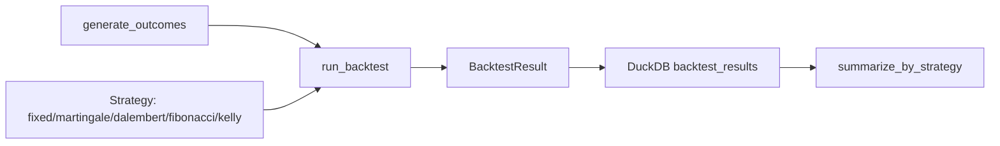

# Architecture

## Why strategies are stateful objects, not pure functions

Martingale needs to remember the last stake; Fibonacci needs to remember a position in the sequence. A pure function `next_stake(history) -> float` would work, but would force every strategy to re-derive its state from the full history on every call. `reset` / `next_stake` / `record_outcome` makes the state explicit and makes each strategy's internal bookkeeping the thing under test in `test_strategies.py`, independent of the backtest engine that drives it.

## Why Kelly is the odd one out

Every other strategy reacts to what just happened: Martingale to a loss, D'Alembert and Fibonacci to a win or a loss. Kelly does not react to anything — it stakes the same fraction of bankroll on every trade, because that fraction already encodes the win probability and payout. That is also why `KellyCriterionStrategy` is constructed with `win_probability` and `payout_ratio` up front rather than learning them from streaks: Kelly is a statement about a known edge, not an adaptation to recent history.

## Why the backtest engine caps every stake at the current bankroll

Martingale's stake grows without bound on a long enough losing streak. Without a cap, a backtest would compute a negative bankroll rather than reporting ruin, which is not what actually happens when a real account runs out of money. Capping the stake at the bankroll and marking `ruined` when it reaches zero is what makes `test_a_strategy_that_outgrows_the_bankroll_is_marked_ruined` a meaningful check on real staking behavior, not just arithmetic.

## Why results go into DuckDB instead of staying as Python objects

A single backtest is one equity curve; the question this repository is actually built to answer — which strategy holds up across hundreds of plausible outcome sequences — needs aggregation across runs. `summarize_by_strategy` is a five-line SQL query once results are in a table; it would be a hand-rolled groupby-and-average over a list of dataclasses otherwise. The table is created fresh per run in `scripts/compare_strategies.py`; nothing about the design depends on persisting between runs.
